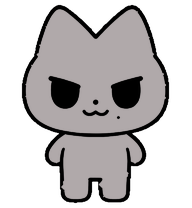
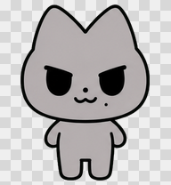
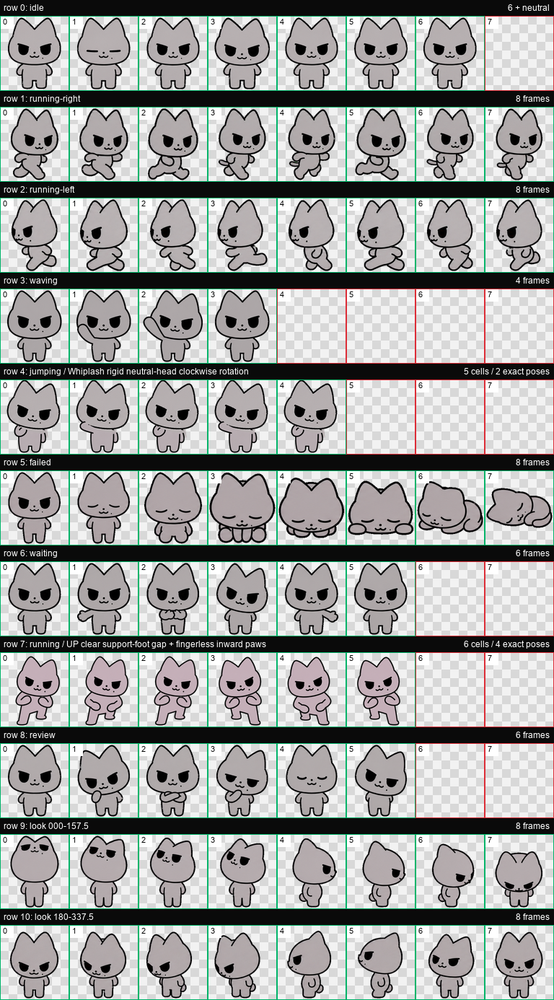

# JUST大猫 Codex Pet

基于aespa Karina非官方二创形象just大猫制作的 Codex 桌面宠物



## 安装前先看

这个宠物需要安装到 **Codex 桌面版**。整个过程不会修改 Codex 程序本身，只会把下面两个宠物文件复制到你的个人目录：

```text
pet.json
spritesheet.webp
```

Windows 用户建议先按“Windows 自动安装”操作；如果脚本无法运行，再使用后面的“Windows 手动安装”。

## Windows 自动安装（推荐）

### 第 1 步：下载项目

1. 点击 [下载项目 ZIP](https://github.com/Au-Cu/just-big-cat-codex-pet/archive/refs/heads/main.zip)。
2. 浏览器开始下载后，等待文件下载完成。
3. 下载到的文件通常叫作 `just-big-cat-codex-pet-main.zip`，一般位于电脑的“下载”文件夹。

### 第 2 步：解压 ZIP

1. 打开电脑的“下载”文件夹。
2. 找到 `just-big-cat-codex-pet-main.zip`。
3. 右键点击它，选择“全部解压”。
4. 在弹出的窗口中点击“解压”。
5. 打开解压后的 `just-big-cat-codex-pet-main` 文件夹。

打开后，应当能直接看到 `install.ps1` 文件和 `pet` 文件夹。

> 必须先解压再安装。不要直接在 ZIP 压缩包预览窗口里运行脚本。

### 第 3 步：运行安装脚本

1. 保持 `just-big-cat-codex-pet-main` 文件夹窗口处于打开状态。
2. 点击文件管理器顶部的地址栏。
3. 输入 `powershell`，然后按回车键。
4. 在弹出的蓝色或黑色 PowerShell 窗口中，复制并运行下面这条命令：

```powershell
powershell -NoProfile -ExecutionPolicy Bypass -File .\install.ps1
```

这条命令只为本次安装临时允许脚本运行，不会永久修改电脑的 PowerShell 安全设置。

看到类似下面的文字，就表示文件已经复制成功：

```text
Installed JUST大猫 to C:\Users\你的用户名\.codex\pets\just-big-cat
```

### 第 4 步：在 Codex 中启用

1. 打开 Codex；如果 Codex 已经开着，可以先关闭再重新打开。
2. 进入 `Settings`（设置）。
3. 打开 `Pets`（宠物）页面。
4. 点击 `Refresh`（刷新）。
5. 在列表中找到并选择 `JUST大猫`。

看到宠物出现在 Codex 窗口中，就说明安装完成。

## Windows 手动安装（脚本无法运行时使用）

这个方法不需要输入 PowerShell 命令。

### 第 1 步：找到两个宠物文件

打开刚才解压的项目文件夹，再打开其中的 `pet` 文件夹。里面应当有：

```text
pet.json
spritesheet.webp
```

同时选中这两个文件，右键选择“复制”。

### 第 2 步：打开 Codex 宠物目录

1. 同时按下键盘上的 `Win + R`。
2. 在“运行”窗口中粘贴下面的路径：

```text
%USERPROFILE%\.codex\pets
```

3. 点击“确定”。
4. 在打开的文件夹中新建一个文件夹，名称必须是：

```text
just-big-cat
```

如果系统提示路径不存在，可以依次新建 `.codex`、`pets` 和 `just-big-cat` 文件夹。

### 第 3 步：复制文件

打开新建的 `just-big-cat` 文件夹，将之前复制的两个文件粘贴进去。最终结构应当是：

```text
C:\Users\你的用户名\.codex\pets\just-big-cat\
├─ pet.json
└─ spritesheet.webp
```

不要在 `just-big-cat` 里面再多放一层 `pet` 文件夹。

完成后重新打开 Codex，进入 `Settings > Pets`，点击 `Refresh`，然后选择 `JUST大猫`。

## macOS / Linux 安装

1. 点击 [下载项目 ZIP](https://github.com/Au-Cu/just-big-cat-codex-pet/archive/refs/heads/main.zip) 并解压。
2. 打开“终端”（Terminal）。
3. 输入 `cd` 和一个空格，然后把解压后的项目文件夹拖进终端窗口，按回车键。
4. 依次运行：

```bash
chmod +x install.sh
./install.sh
```

安装完成后，文件会位于：

```text
~/.codex/pets/just-big-cat
```

然后重新打开 Codex，进入 `Settings > Pets`，点击 `Refresh`，并选择 `JUST大猫`。

如果脚本无法运行，也可以手动把 `pet` 文件夹中的 `pet.json` 和 `spritesheet.webp` 复制到上面的目录。

## 更新宠物

重新下载最新的项目 ZIP，解压后再次运行安装脚本即可。安装脚本会覆盖旧的 `pet.json` 和 `spritesheet.webp`，不会删除其他宠物。

更新后请在 `Settings > Pets` 中点击 `Refresh`。如果仍显示旧版本，关闭并重新打开 Codex。

## 卸载宠物

删除下面这个文件夹，然后重新打开 Codex：

- Windows：`%USERPROFILE%\.codex\pets\just-big-cat`
- macOS / Linux：`~/.codex/pets/just-big-cat`

只删除 `just-big-cat` 文件夹，不要删除整个 `pets` 文件夹，否则可能同时移除其他宠物。

## 常见问题

### PowerShell 提示“禁止运行脚本”或“无法加载文件”

不要双击 `install.ps1`。请在解压后的项目文件夹地址栏中输入 `powershell`，按回车，然后完整运行：

```powershell
powershell -NoProfile -ExecutionPolicy Bypass -File .\install.ps1
```

如果仍然失败，直接使用上面的“Windows 手动安装”方法。

### 提示找不到 `install.ps1`

PowerShell 当前打开的不是正确文件夹。确认窗口所在目录中能看到 `install.ps1`，再运行安装命令。

### 提示找不到 `pet.json` 或 `spritesheet.webp`

通常是因为 ZIP 没有完整解压，或者项目文件夹结构被移动过。重新下载项目 ZIP，选择“全部解压”，不要单独移动 `install.ps1`。

### Pets 列表中没有 `JUST大猫`

请检查下面两个文件是否直接位于 `just-big-cat` 文件夹内：

```text
%USERPROFILE%\.codex\pets\just-big-cat\pet.json
%USERPROFILE%\.codex\pets\just-big-cat\spritesheet.webp
```

确认后在 `Settings > Pets` 中点击 `Refresh`，必要时重启 Codex。

### 能看到名称，但宠物不显示或显示异常

确认 `spritesheet.webp` 没有被改名，也没有变成 `spritesheet.webp.webp`。重新复制项目中的两个宠物文件并覆盖旧文件，然后刷新宠物列表。

### 更新后仍显示旧描述或旧图像

先点击 `Refresh`。如果没有变化，完全退出 Codex 后重新打开。

## 特性

- Codex Pet v2 图集：1536 × 2288、8 列 × 11 行、RGBA WebP
- 9 组动画状态：待机、左右移动、挥手、悬停触发的《Whiplash》动作、失败、等待、任务运行时的《UP》动作和审核
- 16 个连续观察方向
- 粗黑描边与简洁灰黑色块，不使用毛绒、摄影或 3D 材质
- 已通过结构、透明通道、色键残留与方向语义检查

将鼠标悬停在宠物上时，`jumping` 状态会播放《Whiplash》“One look give 'em Whiplash”的五帧单侧抓颈抬肘动作。抓颈手始终固定在画面左侧颈部，另一只手臂在画面右侧自然下垂，不镜像身体或交换双手。头部不再重新绘制：它直接采用待机状态的原始中性头，把头形、双眼上沿、眼睛、鼻子、嘴和右脸小痣合成一个刚性整体，以头部中心为不动点顺时针旋转 8°，因此五官与眼线上沿会和整颗头完全同步，不会出现单侧挑眉，耳尖也不会碰到画布边界。第 1、3、5 帧主动肘在身前低位，第 2、4 帧向画面左侧外旋到高位，形成“低—高—低—高—低”的清楚循环；身体、抓颈手和双脚仍保持原来的位置，也不添加进入或收尾动作。


当 Codex 进入 `running`（任务正在运行）状态时，会播放《UP》“I pump it, I pump it, I pump it up”的六格甩手动作。第 1、2、3 格保持同一侧支撑脚和同一条倾斜直轴，第 4、5、6 格换到另一侧；头、颈、躯干、骨盆和支撑腿保持同向，不把角色弯成弧线。六格中双肘始终是手臂最外点，大臂先向外、前臂再折回中线，两只圆爪始终互相指向，轮廓读作 `<>`。第 1、3、4、6 格手腕高于肘、掌背朝外；第 2、5 格手腕低于肘、掌心朝地，但手仍朝内，不摊成 `_/身体\_`。圆爪统一为无手指、无分叉、无尖角的光滑手套轮廓。每一格的支撑脚都稳定落在较低基线，另一只脚整只抬起且脚底水平位置明显更高，不露脚底或肉垫；右脸小痣在六格中保持同一脸部位置，也不添加其他动作。



> 当前 Codex Pet v2 运行时对这两行使用固定格数：`jumping` 读取 5 格，`running` 读取 6 格，而且透明格也会被照常播放。Whiplash 写入 `低—高—低—高—低`；UP 写入 `左组上—左组下—左组上—右组上—右组下—右组上`。其中第 1 与第 3 格、第 4 与第 6 格分别是像素完全相同的姿势，循环不会在末格和首格之间多出不对称动作。逐帧研究来源和运行时映射记录在 [`qa/choreography-references.md`](qa/choreography-references.md)。



## 仓库结构

```text
pet/
  pet.json             Codex Pet v2 清单
  spritesheet.webp     透明动画图集
preview/
  base-preview.png     标准站姿
  contact-sheet.png    动作与方向总览
  look-directions.png  16 方位复核图
  up-dance.gif         六运行时格的任务动作预览
  whiplash-dance.gif   五帧悬停动作预览
qa/
  validation.json      自动结构验证报告
  choreography-references.md
  direction-semantics.json
  final-visual-qa.txt
```

## 许可证

- 配置、文档和安装脚本：[MIT](LICENSE)
- 本仓库作者原创的视觉素材：[CC BY 4.0](ASSET-LICENSE.md)

授权仅覆盖仓库贡献者拥有权利的内容。项目名称或形象若包含第三方既有名称、角色、商标或其他受保护元素，这些权利不因本仓库许可证而被授予。详见 [NOTICE](NOTICE.md)。

## English

An unofficial Codex desktop pet based on the aespa Karina fan-created character “JUST Big Cat.” Hovering triggers a five-frame “Whiplash” neck-grab pulse: the original neutral head and every facial feature rotate together as one rigid layer, 8° clockwise around the head center. While a task is running, “UP” uses L-up, L-down, L-up, R-up, R-down, R-up: elbows remain outermost, both forearms fold inward, the smooth fingerless paws face each other in a clear `<>` silhouette, and the grounded support foot sits visibly lower than the lifted foot.

Download and extract the [project ZIP](https://github.com/Au-Cu/just-big-cat-codex-pet/archive/refs/heads/main.zip). On Windows, open PowerShell in the extracted folder and run:

```powershell
powershell -NoProfile -ExecutionPolicy Bypass -File .\install.ps1
```

On macOS or Linux, run:

```bash
chmod +x install.sh
./install.sh
```

Restart Codex, open `Settings > Pets`, click `Refresh`, and select `JUST大猫`.
